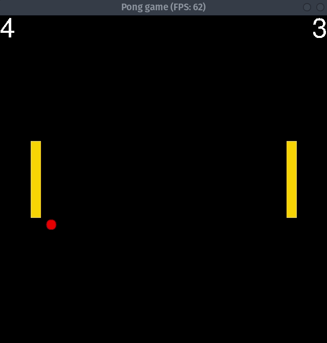

# CPPND: Capstone Pong Game

Pong is a classic 2D table tennis-themed video game, which consists of two vertically moving paddles and a ball that bounces off the window edges and the inner side of the paddles. 

The keyboard controls for the paddle are as follows:
* 'q' / 'a': up/down for the left paddle
* 'p' / 'l': up/down for the right paddle

Two players compete against each other by preventing the ball from moving beyond their paddle. The game ends when a player reaches 10 points.

## Dependencies for Running Locally
* cmake >= 3.7
  * All OSes: [click here for installation instructions](https://cmake.org/install/)
* make >= 4.1 (Linux, Mac), 3.81 (Windows)
  * Linux: make is installed by default on most Linux distros
  * Mac: [install Xcode command line tools to get make](https://developer.apple.com/xcode/features/)
  * Windows: [Click here for installation instructions](http://gnuwin32.sourceforge.net/packages/make.htm)
* SDL2 >= 2.0
  * All installation instructions can be found [here](https://wiki.libsdl.org/Installation)
  >Note that for Linux, an `apt` or `apt-get` installation is preferred to building from source. 
* SDL2_ttf >= 2.0
  * All installation instructions can be found [here](https://www.libsdl.org/projects/SDL_ttf/)
  >Note that for Linux, an `apt` or `apt-get` [installation](https://packages.ubuntu.com/search?keywords=libsdl2-ttf) is preferred to building from source.
  
  >Use **SDL2_ttf**, not SDL_ttf
* gcc/g++ >= 5.4
  * Linux: gcc / g++ is installed by default on most Linux distros
  * Mac: same deal as make - [install Xcode command line tools](https://developer.apple.com/xcode/features/)
  * Windows: recommend using [MinGW](http://www.mingw.org/)

## Basic Build Instructions

1. Clone this repo.
2. Make a build directory in the top level directory: `mkdir build && cd build`
3. Compile: `cmake .. && make`
4. Run it: `./PongGame`.
>NOTE: Segmentation fault might occur due to font not being loaded properly, in which case you want to make sure that **SDL2_ttf** is used during compilation and/or set the filenames to absolute paths (renderer.h Line 54 and 55). 

## Rubric requirements
1. >Loops, Functions, I/O
    * The project accepts user input and processes the input (see Controller::GetKeyboardInputs).
2. >Object Oriented Programming
    * The project uses Object Oriented Programming techniques.
    * Classes use appropriate access specifiers for class members.
    * Class constructors utilize member initialization lists.
    * Classes abstract implementation details from their interfaces (see Renderer class).
    * Classes follow an appropriate inheritance hierarchy (see GameObject, Paddle and Ball class).
    * Overloaded functions allow the same function to operate on different parameters (see Renderer::Render functions).
    * Derived class functions override virtual base class functions (see Paddle::Move and Ball::Move).
3. >Memory Management
    * The project follows the Rule of 5 (see Score class).
    * The project uses smart pointers instead of raw pointers (See Game::left_paddle_ and Game::right_paddle_).
4. > Concurrency
    * The project uses multithreading (see Game::Run in which 3 threads is running in parallel alongside the game thread).
    * A mutex or lock is used in the project (see Controller, CollisionEngine, Paddle, and Ball class).
    * A condition variable is used in the project (see collision_engine.h SignalQueue class). 

## Acknowledgement
This project is based on the starter repo for the Capstone project in the [Udacity C++ Nanodegree Program](https://www.udacity.com/course/c-plus-plus-nanodegree--nd213). 
## CC Attribution-ShareAlike 4.0 International

Shield: [![CC BY-SA 4.0][cc-by-sa-shield]][cc-by-sa]

This work is licensed under a
[Creative Commons Attribution-ShareAlike 4.0 International License][cc-by-sa].

[![CC BY-SA 4.0][cc-by-sa-image]][cc-by-sa]

[cc-by-sa]: http://creativecommons.org/licenses/by-sa/4.0/
[cc-by-sa-image]: https://licensebuttons.net/l/by-sa/4.0/88x31.png
[cc-by-sa-shield]: https://img.shields.io/badge/License-CC%20BY--SA%204.0-lightgrey.svg
